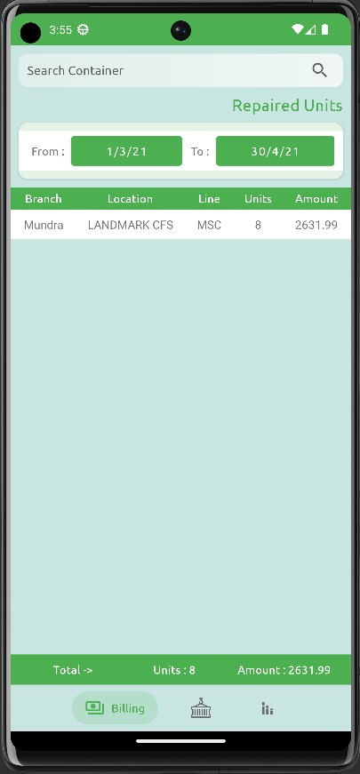
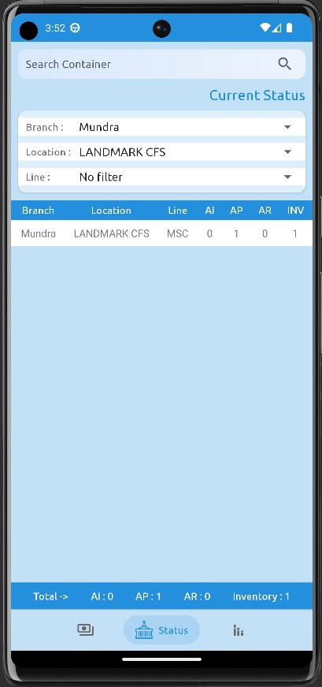
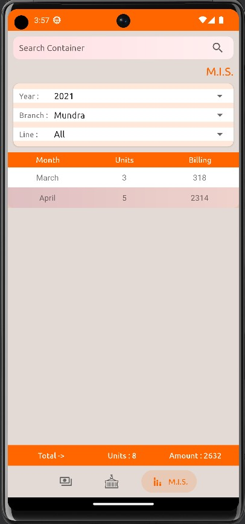

<!-- PROJECT LOGO -->
 

  

<h3 align="center">M&R</h3>

  

    Container Yard Analysis Project
     
  

<!-- TABLE OF CONTENTS -->

  
Table of Contents

  <ol>
    <li>
      <a href="#about-the-project">About The Project</a>
      <ul>
        <li><a href="#built-with">Built With</a></li>
      </ul>
    </li>
    <li><a href="#acknowledgments">Acknowledgments</a></li>
  </ol>

<!-- ABOUT THE PROJECT -->
## About The Project

This is an android project app, made for container yards to review status for containers and billing.

>There are three types of container yard users can use this project :
> * #### Field Worker
> * #### Manager
> * #### Owner

##### Field Worker :

> Use case for this type of user is to check status of individual container available in yard. they can review details like Container id, Container size, Container type, arrival date, Mfg Year, Mfg Month, Cost, Remarks, etc. The restriction is they can't access Billing and other branch's data.

##### Manager :

> This type of users can access whatever field worker can + access of billing data of particular branch.

##### Owner :

> This individual can access anything of any branch.

---

##### How this project collects data?

> basically manager of every branch maintains excel sheet for records which is provided to the database and this project manipulate those records in such a way that users can see them according to their type.

---

##### Authentication :

> This project is integrated with firebase auth which authenticate user by their mobile number using OTP. and after successful registration it generates unique device id which is based on individual mobile device which means if user uninstalls app and re-installs it, he needs to re-register his device. In addition, Admin needs to grant permission to access yard's data for individual user by unique device id.

---

### Built With

* ![Android Studio][android-studio]
* ![Firebase][firebase]

---

<!-- ACKNOWLEDGMENTS -->
## Acknowledgments

* [Chip Navigation Bar](https://github.com/ismaeldivita/chip-navigation-bar)
* [Android-SpinKit](https://github.com/ybq/Android-SpinKit)
* [Animated SVG View](https://github.com/jaredrummler/AnimatedSvgView)

<!-- MARKDOWN LINKS & IMAGES -->
[android-studio]: https://img.shields.io/badge/Android%20Studio-3DDC84.svg?style=for-the-badge&logo=android-studio&logoColor=white
[Firebase]: https://img.shields.io/badge/Firebase-039BE5?style=for-the-badge&logo=Firebase&logoColor=white